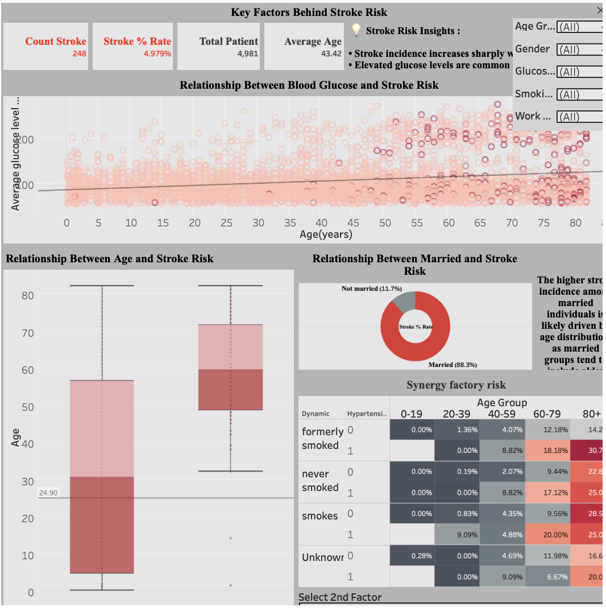

# 🎨 Tableau BI Dashboard: Key Factors Behind Stroke Risk

This interactive dashboard is the final BI delivery of the brain stroke risk factors research. It is designed for the visual analysis of patient metrics, helping to quickly identify high-risk groups.

* **Interactive Live Version:** [Open Dashboard on Tableau Public](https://public.tableau.com/views/KeyFactorsBehindStrokeRisk/Dashboard1?:language=en-US&:sid=&:redirect=auth&:display_count=n&:origin=viz_share_link)

---

## 📊 Dashboard Visual Structure

1. **Key Performance Indicators (KPI Cards):**
   * **Total Patient:** Total number of analyzed patients.
   * **Count Stroke:** Total number of recorded stroke incidents.
   * **Stroke % Rate:** Percentage of stroke cases relative to the total sample.
   * **Average Age:** Average age of the analyzed patients.
2. **Relationship Between Blood Glucose and Stroke Risk:** Shows the correlation between glucose levels and age, and how these factors impact stroke occurrence.
3. **Relationship Between Age and Stroke Risk:** Clearly demonstrates that a critical increase in the number of cases occurs in age groups 60 and older.
4. **Relationship Between Married and Stroke Risk:** This metric is quite intriguing; however, since stroke is predominantly a disease affecting older adults, the high stroke risk observed among people who have ever been married is likely age-related.
5. **Synergy factory risk:** Shows the probability of stroke when there is a synergy between Hypertension and Glucose Status / BMI Category / Work Type / Smoking Status.

---

## 🎛️ Interactive Filters
Users can filter all dashboard metrics in real-time by:
* **Age Group**
* **Smoking Status**
* **Gender**
* **Glucose Status**
* **Work Type**

---

## 🖼️ Preview

